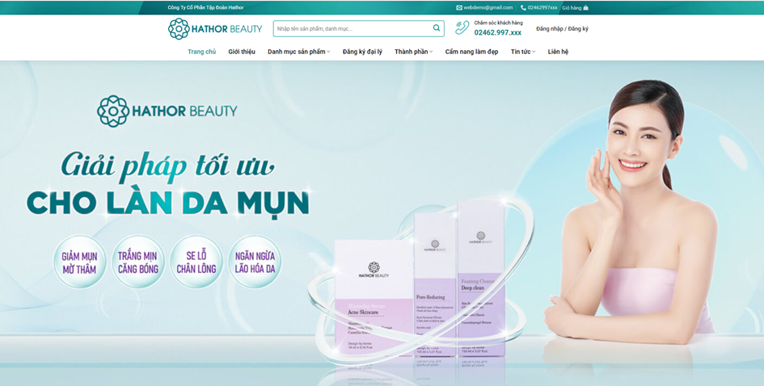
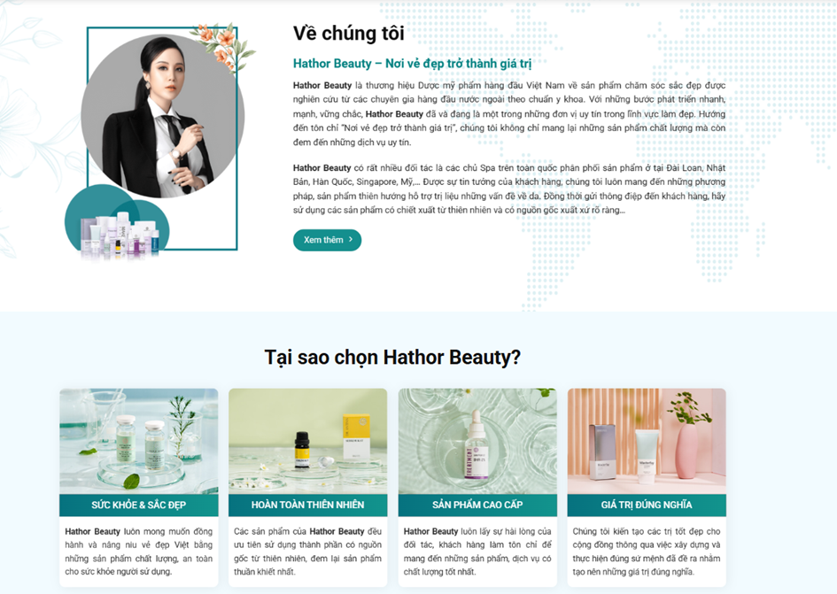
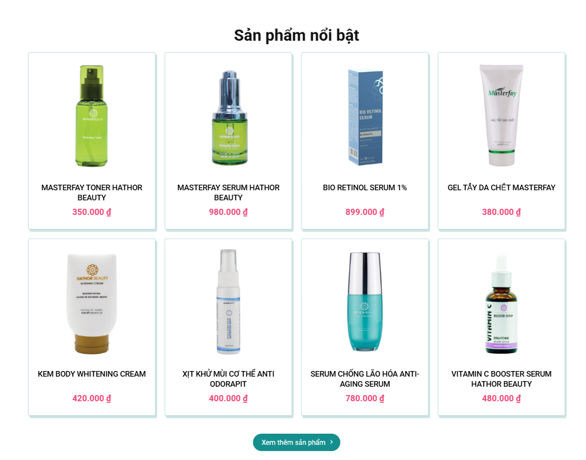
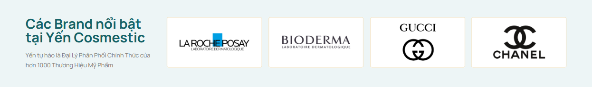
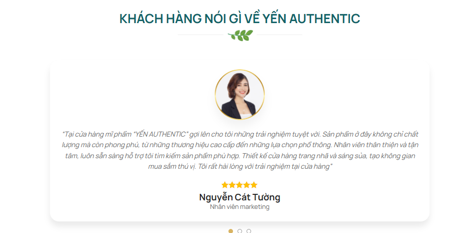
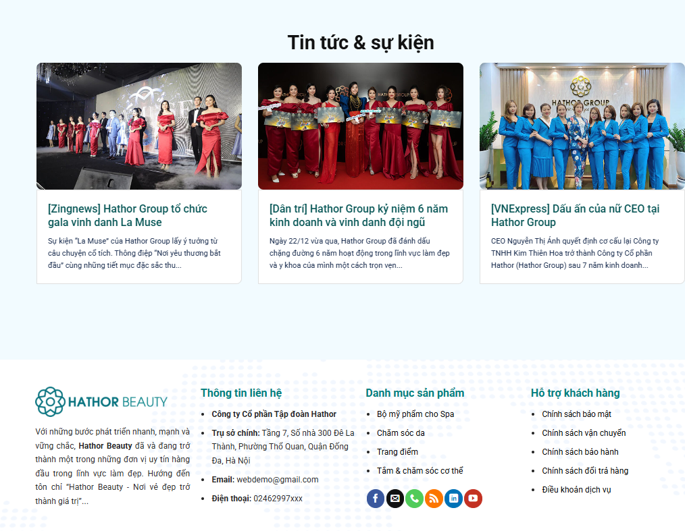
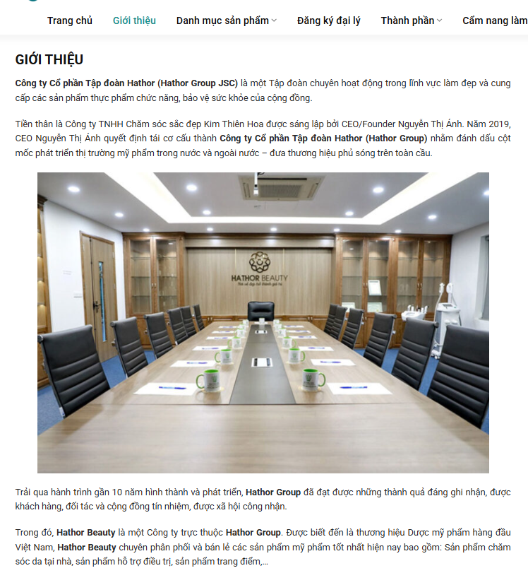
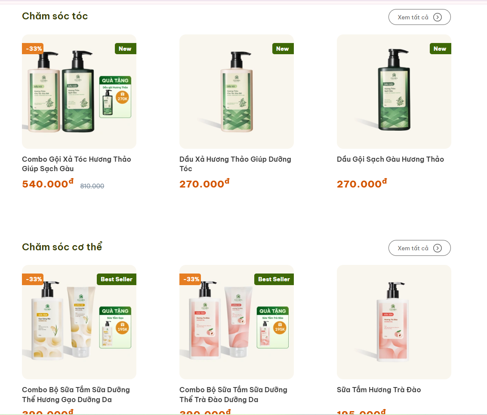
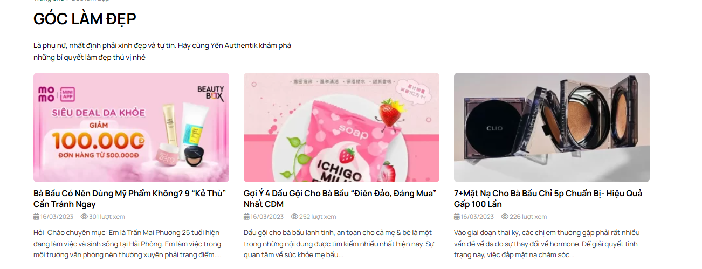
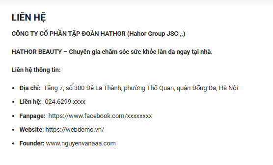

**Bản demo thiết kế website**

Header:

* Trang chủ
* Giới thiệu
* Sản phẩm
* Tin tức
* Liên hệ

**Nội dung của phần về chúng tôi:**

Công ty TNHH JP Bùi Đặng là doanh nghiệp chuyên nhập khẩu và phân phối các sản phẩm chính hãng từ Nhật Bản tại thị trường Việt Nam. Với hơn 15 năm kinh nghiệm trong ngành nhập khẩu và phân phối, đồng hành cùng các thương hiệu Nhật Bản trong các lĩnh vực mỹ phẩm, chăm sóc sức khỏe, làm đẹp và hàng tiêu dùng. Với cam kết mang đến sản phẩm chính hãng, chất lượng cao, JP Bùi Đặng không ngừng kết nối người tiêu dùng Việt Nam với tinh hoa tiêu dùng từ Nhật Bản.

**Note: Nếu phần banner hiện full dc chữ thì có thể bỏ qua phần tại sao chọn JP Bùi Đặng vì thông tin đã hiển thị đủ ở banner rồi**

Sản phẩm nổi bật thì anh giúp em để những sản phẩm sau:

<https://drive.google.com/drive/folders/1RWAw03saROUU2BIJGxEAf_JdsKSSgMOS?usp=sharing>

Thông tin thêm thì anh kiếm ở google giúp e ạ

**Anh giúp em để các Brand sau (dẫn link khi ấn vào ảnh nữa ạ)**

Fractional CC :

<https://prtimes.jp/main/html/rd/p/000000003.000132955.html>

<https://fractionalcc.jp/>

Fru:C

<https://www.fru-c.com/vision.html>

<https://bshiki.jp/shop/pages/fruc>

MAX:

<https://www.soapmax.co.jp>

Kor Japan:

<https://www.superdelivery.com/p/do/dpsl/di/1003000/>

<https://www.kor-japan.co.jp/en/>

Japangals:

[https://web.facebook.com/japangalshk/photos/?\_rdc=1&\_rdr#](https://web.facebook.com/japangalshk/photos/?_rdc=1&_rdr)

<https://japangals.jp/>

Kumano:

<https://hachihachi.com.vn/thuong-hieu/kumano-yushi-nhat-ban?srsltid=AfmBOooasvMrGcOvQVHm-8i9OkQNaiXvzHXsd8CH1ZsZctN_769HrNuY>

<https://www.kumanoyushi.co.jp/en/products/index.html>

### **Khách hàng 1 – Người tiêu dùng**

*"Mình biết đến JP Bùi Đặng qua một người bạn giới thiệu và đến nay đã sử dụng sản phẩm của công ty hơn một năm. Điều khiến mình hài lòng nhất là sản phẩm luôn có nguồn gốc rõ ràng, chất lượng ổn định và đúng như mô tả. Từ serum, mặt nạ đến các sản phẩm chăm sóc cá nhân đều mang lại trải nghiệm rất tốt. Mình hoàn toàn yên tâm khi lựa chọn JP Bùi Đặng mỗi khi cần mua hàng Nhật chính hãng."*

### **Khách hàng 2 – Người yêu mỹ phẩm Nhật**

*"Là người yêu thích mỹ phẩm nội địa Nhật, mình khá kỹ tính khi lựa chọn nơi mua hàng. Sau nhiều lần trải nghiệm, JP Bùi Đặng là đơn vị khiến mình tin tưởng nhất. Không chỉ sản phẩm chính hãng mà đội ngũ tư vấn còn rất am hiểu, luôn hỗ trợ lựa chọn sản phẩm phù hợp với nhu cầu. Mình sẽ tiếp tục đồng hành cùng JP Bùi Đặng trong thời gian tới."*

### ***Đại lý phân phối***

*"Chúng tôi đã hợp tác với JP Bùi Đặng trong nhiều năm và đánh giá rất cao sự chuyên nghiệp của đội ngũ. Nguồn hàng luôn ổn định, chính sách hợp tác minh bạch và quá trình xử lý đơn hàng diễn ra nhanh chóng. Điều này giúp chúng tôi chủ động hơn trong việc kinh doanh và xây dựng niềm tin với khách hàng của mình."*

**Trang giới thiệu**

****

**Nội dung:**

<https://docs.google.com/document/d/1vgcKcbKX7zd-ZweQ6UXByWxuFNEnOHA_4FUPPJiDoqg/edit?usp=sharing>

**Trang sản phẩm**

Cụ thể các đầu mục ở web:

1. **Mỹ phẩm gồm các mục con sau:**

Chăm sóc da:

* Toner, nước hoa hồng
* Serum
* Kem dưỡng
* Mặt nạ
* Rửa mặt
* Tẩy trang

Chăm sóc tóc:

* Dầu gội
* Dầu xả

Cơ thể:

* Sữa tắm
* Xà phòng
* Chăm sóc răng miệng

### **Hàng tiêu dùng**

1. **Thực phẩm**

Bản sẽ hiển thị trên web khi bấm vào trang sản phẩm 

**Trang tin tức**

**Trang liên hệ**

Thông tin cho vào web:

CÔNG TY TNHH JP- BÙI ĐẶNG

Địa chỉ: Tầng 1, CT2, Mễ Trì Thượng, Nam Từ Liêm, Hà Nội

Fanpage: <https://web.facebook.com/hangnhatchomoinha.vn>

Liên hệ: 098 5561862 - 0965180859

Email: jpbuidangco.ltd@gmail.com